This document contains the screenshot and output of all lab activities completed. 

Session 1a - AM

------------------------------

1️⃣ GitHub Repository Creation

 

  

A GitHub account was created and a new repository was set up to document all lab activities.
As I had no prior experience using GitHub, the web interface was used to create and manage the repository.
This repository is used to store screenshots and written documentation for each lab session.

2️⃣ Downloading Ubuntu ISO

  

The Ubuntu ISO file was downloaded from the official Ubuntu website.
This ISO file is required to install Ubuntu as a guest operating system within a virtual machine.
Downloading the ISO from the official source ensures system reliability and security.

3️⃣ Ubuntu Desktop Environment

  

  

This screenshot shows the Ubuntu desktop after successful installation.
It confirms that the virtual machine has booted correctly into the graphical user interface.
From this desktop, system applications and tools can be accessed.

4️⃣ Navigating the Ubuntu File System (GUI)

  
 
  

  

The Ubuntu file manager was used to navigate directories such as Home and Downloads.
This demonstrates basic familiarity with the graphical file system in Ubuntu.
Downloaded files and documents are managed using these folders.

5️⃣ Internet Access Using Firefox

 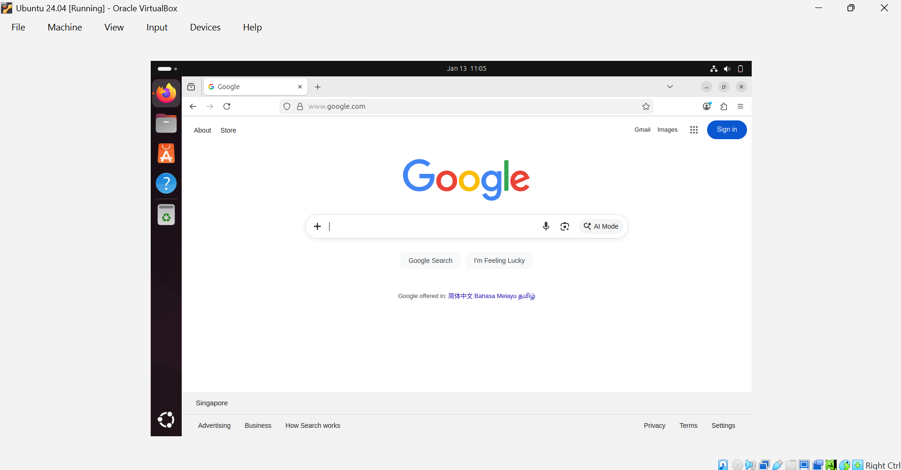 

  

The Firefox web browser was launched successfully in Ubuntu.
This confirms that the virtual machine has working internet connectivity.
Internet access is required for downloading applications and system updates.
I have also created a word document account and created a document. 

6️⃣ Downloading and Running a Calculator Application

  
 
  

These screenshots show a calculator application being downloaded and opened in Ubuntu.
The application was launched to verify that it was installed successfully.
This demonstrates basic application installation and execution within the Linux environment.

7️⃣ LibreOffice Writer

  
 
 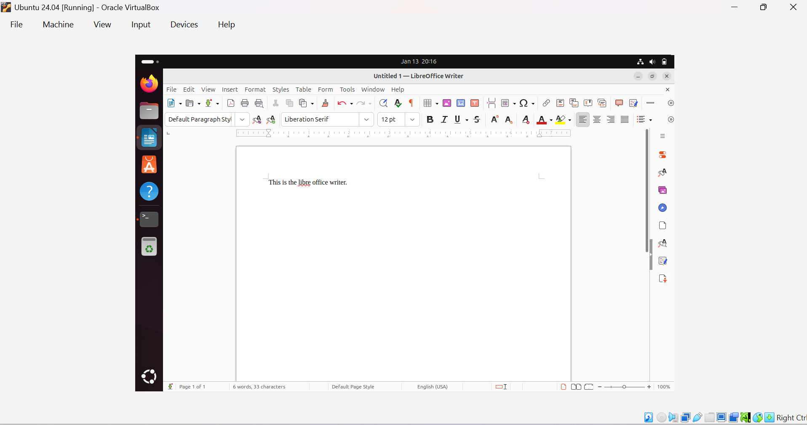 

LibreOffice Writer was opened successfully in Ubuntu.
This confirms that productivity applications are available and functional.
LibreOffice Writer can be used to create and edit documents within the Linux system.

8️⃣ Command Line Access and Usage

  
 
  
 
  

  

  

  

  

  

  

  

The terminal was accessed to interact with the system using command-line input.
These screenshots demonstrate successful access to and use of the Linux terminal.
The command line is an essential tool for system navigation and administration.

Session 1B - PM
------------------------------

1️⃣ Viewing Linux Services

 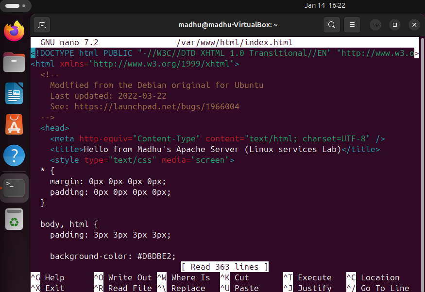 
 
 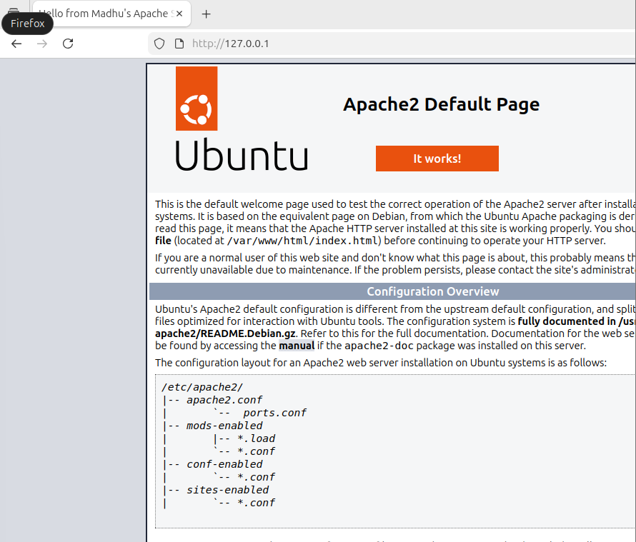 

2️⃣ Installing and Verifying a Service (Apache)

  

  

  

A service was installed on the Ubuntu system and verified after installation.
The output confirms that the service was successfully installed and is running.
This demonstrates basic service installation and verification in Linux.

3️⃣ Additional Linux Commands Executed

  
 
  
 
  
 
  
 
  
 
  
 
  
 
  
 
  
 
  
 
  

These screenshots show the execution of additional Linux commands using the terminal.
The commands were run to practice interacting with the Linux system and viewing outputs.
This helps build familiarity with basic command-line operations in Ubuntu.

4️⃣ User and Group Creation

 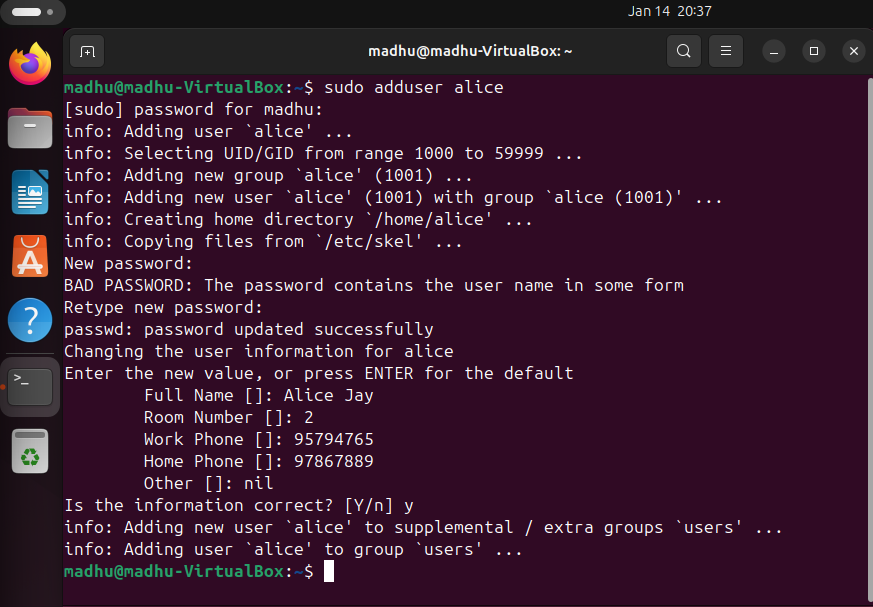 
 
 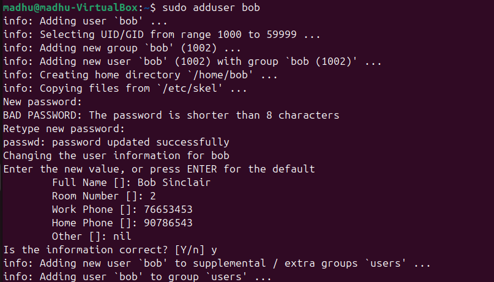 
 
 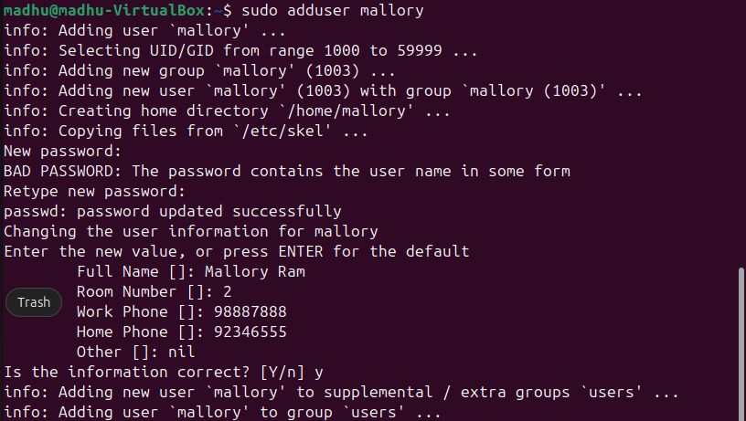 
 
 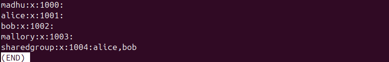 

These screenshots show the creation of multiple users and a shared group in Linux.
Users alice, bob, and mallory were created, and a shared group was set up to manage access control.
This forms the foundation for testing file permissions and group-based access.

5️⃣Creating a Shared Directory and Files

 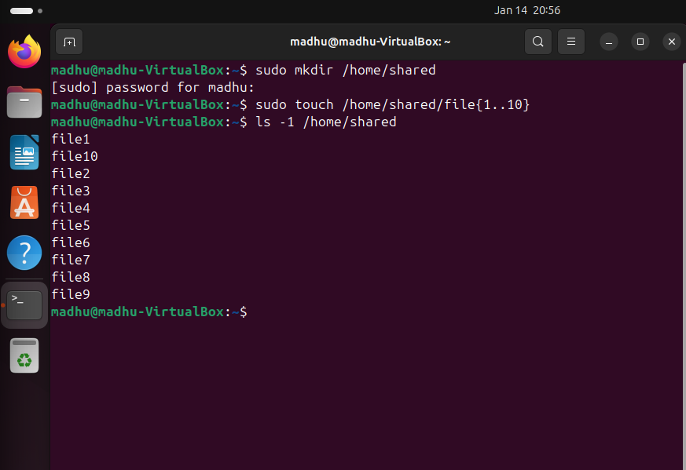 
 
 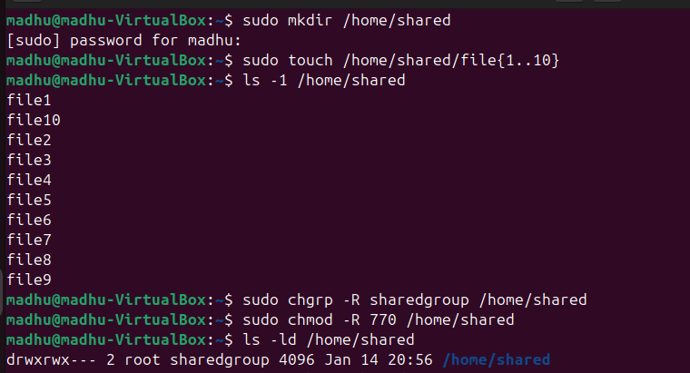 

These screenshots demonstrate the creation of a shared directory and multiple files within it.
The directory was prepared to be accessed by users belonging to the shared group.
This step ensures that files are available for permission testing.

6️⃣ Setting Ownership and Permissions

 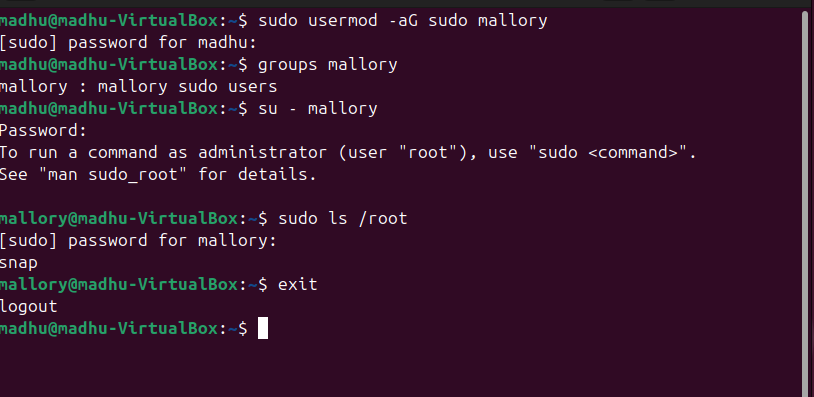 
 
 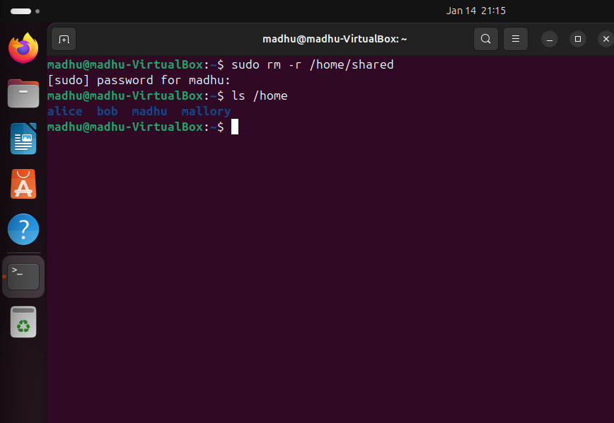 

These screenshots show ownership and permission settings being applied to the shared directory and files.
Permissions were configured to control read, write, and execute access.
This step was critical for the enforcement of secure access control in Linux systems.

7️⃣ Access Testing as Different Users

 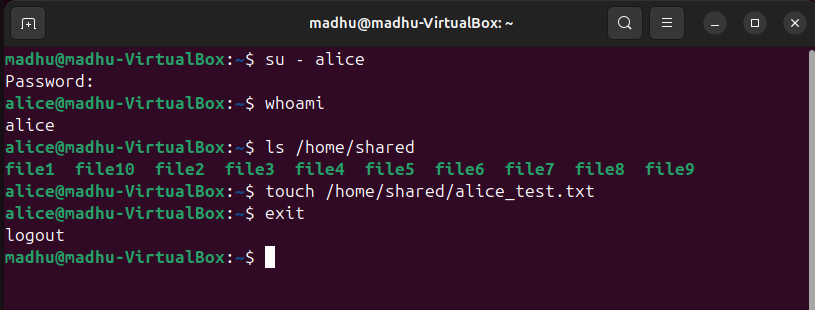 
 
 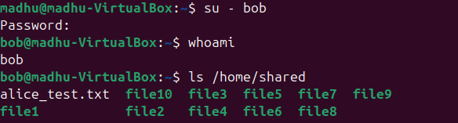 
 
 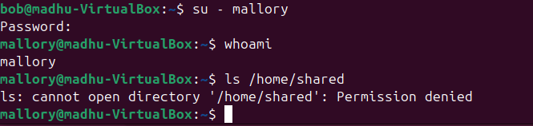 

These screenshots demonstrate access testing by switching between different users.
Each user’s ability to access the shared directory was verified based on assigned permissions.
This confirms that access control rules were applied correctly.

8️⃣ Cleanup and Verification

  

This screenshot show the cleanup process after testing was completed.
The shared directory and files were removed to return the system to a clean state.
This marks the proper completion of the lab activity.

9️⃣ Extracting the Gutenberg Archive

 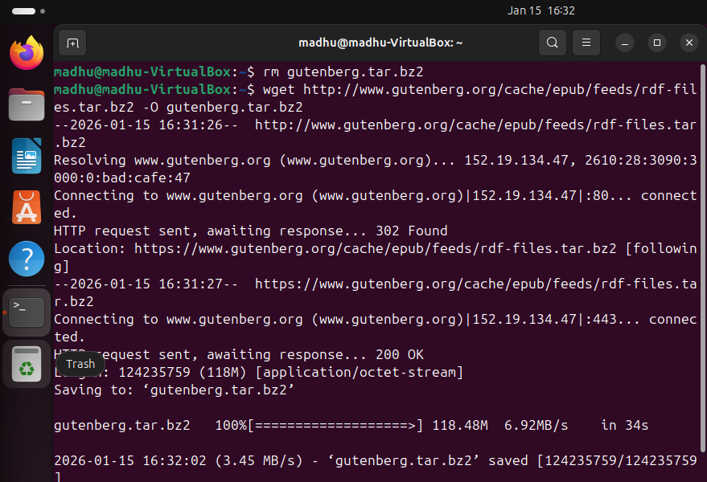 

This screenshot show the extraction of the Gutenberg archive using Linux command-line tools.
The compressed archive was successfully decompressed and extracted into a directory.
This confirms that archive handling and extraction were completed correctly.

🔟 Listing and Exploring Extracted Files

 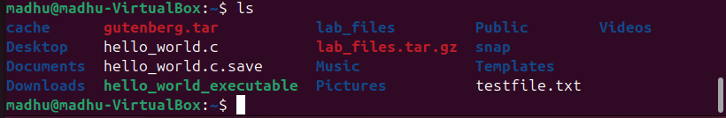 

This screenshot demonstrate listing the contents of the extracted Gutenberg directory.
The file structure was viewed to confirm that text files were extracted successfully.
This step verifies the integrity of the extracted archive.

1️⃣1️⃣ Searching Files by Name

 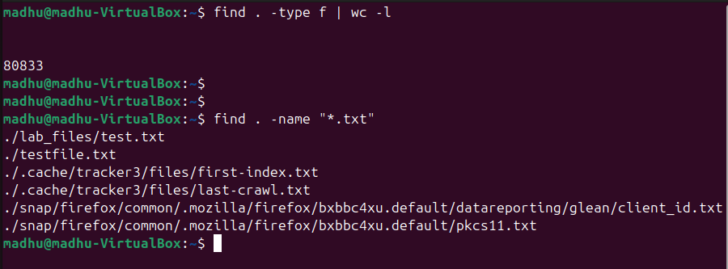 

This screenshot show searching for files based on filename patterns within the directory.
This demonstrates how Linux commands can locate files using extensions or names.
Filename searching is useful when managing large collections of files.

1️⃣2️⃣ Searching Text Content Within Files

 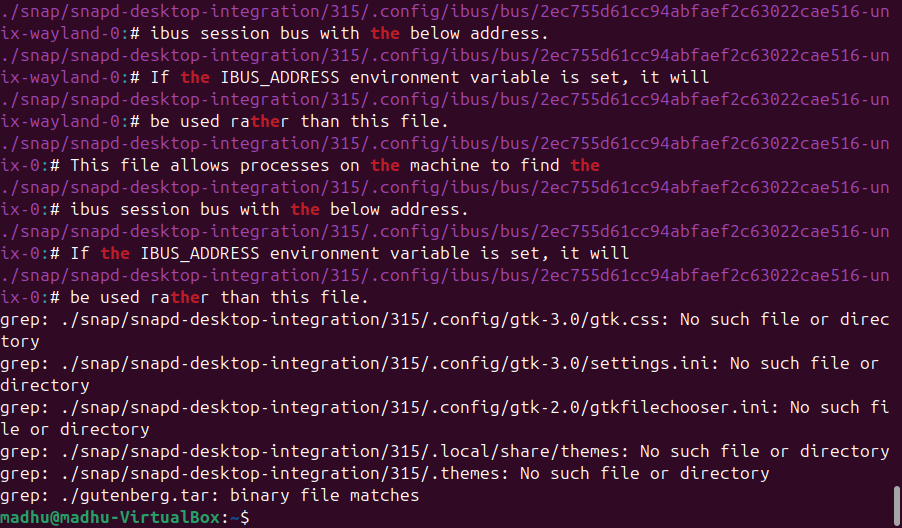 

This screenshot  demonstrate searching for specific text content within files.
The search was performed across multiple files to locate matching words or phrases.
This technique is essential for analysing large text datasets.

Session 2B - PM
------------------------------

1️⃣ Cloud Platform Access / VM Environment Setup

  

  

These screenshots shows access to the virtual machine or cloud environment used for the lab.
The environment was successfully accessed and prepared for further configuration tasks.
This confirms that the system was ready for cloud-based operations.

2️⃣ Creating and Launching a Cloud Virtual Machine

  

  

  

  

  

These screenshots shows the creation and launching of a virtual machine instance.
The instance was configured with the required operating system and default settings.
This step verifies successful deployment of a cloud-based virtual server.

3️⃣ Connecting to the Virtual Machine (SSH)

  

  

These screenshots shows a successful connection to the virtual machine using the command line.
This confirms that the virtual machine is reachable and operational. 
Since i had 2 accounts the pem key has a different name but after these activities i used the other pem key that would be mentioned in the following activities. 

4️⃣Installing Apache Web Server via CLI

  

  

  

  

This screenshot shows the installation of the Apache web server using the command line.
The required packages were installed successfully on the virtual machine.
This prepares the system for hosting a web application.

5️⃣Bash scripting

  

  

  

  

 
This is the first screenshot after the command. I didnt add the middle parts as it there are many. 

 

This is the last screenshot after the command. 

  

  

  

  

These screenshots are bash scripting. 

Session 3A - AM
------------------------------
1️⃣ Domain Setup and DNS Resolution

 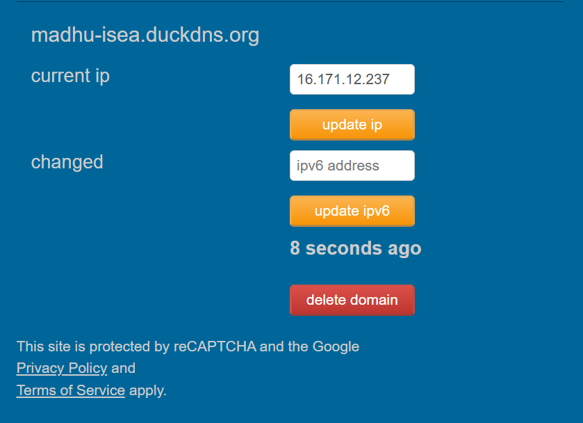 
 
  

A DuckDNS domain was created and linked to the public IP address of the AWS EC2 instance.
DNS resolution was verified from the terminal to ensure the domain correctly points to the server.
This step confirms that the domain is ready to be used with the web server.

2️⃣Apache Web Server Installation and HTTP Access

  
 
  

  

  

  

Apache web server was installed on the Ubuntu EC2 instance.
The website was accessed using HTTP to confirm Apache was running correctly.
This verifies basic web hosting functionality before applying security.

SSL Certificate Installation using Certbot

  
 
  
 
  

Certbot was installed to obtain an SSL certificate from Let’s Encrypt.
An SSL certificate was successfully generated and deployed to Apache.
This enables encrypted HTTPS communication for the website.